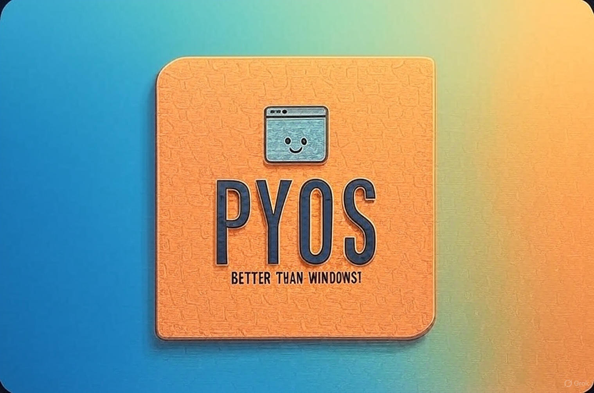

<h1 align="center">
  
   
   
  PyOS
   
</h1>

<h4 align="center">An OS that is written in Python and it's better than Windows 👍</h4>

## Story

Soooo this is a small side project that I do just for fun when I have free time! I started it some months ago and I still develop it just for having something to do. The OS is simple but colorful, fun to add your own commands and ready to use.

## Features

Get ready for...

- 😮 An interactive command line interface with a million different colors so your eyes will return to grayscale!
- 😎 Authentication system so your password will be hashed and NOBODY will be able to login so your unencrypted files can be safe!
- 🤑 Ability to add your own commands with as little lines of code as possible.
- 😄 As little requirements as possible so you can get to the fun part quickly.
- 😁 Anddd in any way it's better than Windows!

## Default Login

Whoops, forgot to mention that the default credentials are `root` and `root`.

## Development

The OS will be developed as quickly as I possibly can™ (get ready for decade updates!) and I will try to add as many features as possible. Please open an issue for any issue you encounter. I am also happy to approve pull requests!

## Installation And Running (2 in 1 😱)!

(Please make sure you have Python3.10 installed else your computer will catch fire, what are you doing with python2?)

(Oh also the OS doesn't work with Windows because of course it wouldn't work with Windows 😅)

> ⚠️ Installation steps will be added once the project is uploaded.

## Try the awesome GUI 🤩!

My eyes couldn't handle how bad it was, soooo, I deleted it 😁!

## License

The license is a simple GNU v3 so you can play with the code as much as your heart wants. I am also not responsible if you manage to fry your computer with a simple Python program. Good luck explaining to the warranty what happened 😁.
